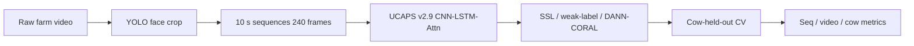
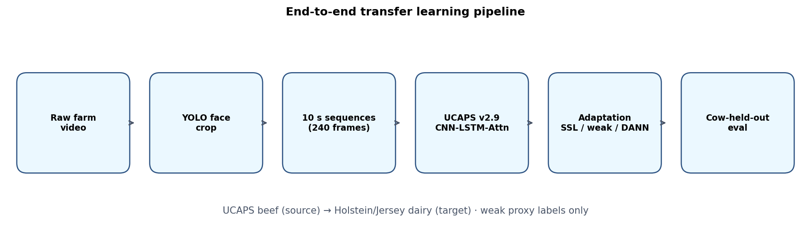
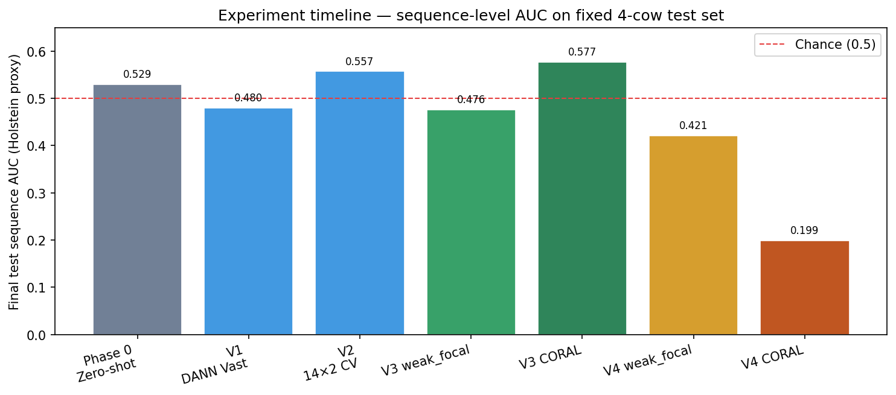

# CowPaincheck Transfer Learning

Transfer learning experiments adapting the **UCAPS v2.9** cattle facial-pain model (beef cattle, castration pain) to **Canadian Holstein/Jersey dairy** farm video with weak `video_health_status` proxy labels.

> **Scope note:** All reported Holstein metrics measure **weak health-proxy separation**, not validated veterinary pain detection. Only UCAPS source metrics use true pain ground truth.

Repository: [github.com/Shivam13602/CowPaincheck-Transfer-Learning-](https://github.com/Shivam13602/CowPaincheck-Transfer-Learning-)

---

## Abstract

We study domain shift between UCAPS beef-cattle pain recognition and Holstein/Jersey dairy herds recorded at RAC/Truro. After zero-shot and weak-label baselines failed to generalize (cow-level AUC ≈ 0.50), we implemented cow-held-out cross-validation with domain-adversarial training (DANN), covariance alignment (CORAL), and focal/GCE weak-label losses. V3 fixed threshold degeneracy and achieved **sequence AUC 0.577 (CORAL)** on a 250-sequence baseline. V4 extended evaluation to a **549-sequence dense thesis dataset** (10 s windows, 8 s stride), adding video- and cow-level metrics; **weak_focal** reached **cow balanced accuracy 0.75** on the fixed 4-cow test set.

---

## End-to-end pipeline





---

## Experiment timeline

| Stage | Folder | Dataset | CV protocol | Best seq AUC | Best cow bacc |
|-------|--------|---------|-------------|-------------:|--------------:|
| **Phase 0** | [`zeroshot_baseline/`](zeroshot_baseline/) | baseline_10s_250 | Pre-DANN baselines | 0.548 | 0.500 |
| **V1** | [`dann_transfer/V1/`](dann_transfer/V1/) | baseline_10s_250 | 7×4, Vast.ai | ~0.48 | ~0.50 |
| **V2** | [`dann_transfer/V2/`](dann_transfer/V2/) | baseline_10s_250 | 14×2, Rorqual | 0.558 | 0.500 |
| **V3** | [`dann_transfer/V3/`](dann_transfer/V3/) | baseline_10s_250 | 7×4 + spec threshold | **0.577** | 0.750 (DANN cal.) |
| **V3.1** | [`dann_transfer/V3.1/`](dann_transfer/V3.1/) | baseline_10s_250 | Literature fork | Appendix | Appendix |
| **V4** | [`dann_transfer/V4/`](dann_transfer/V4/) | thesis_stride8_qa (549) | 9×3 + video metrics | 0.421 | **0.750** (weak_focal) |
| **V5** | [`dann_transfer/V5/`](dann_transfer/V5/) | 549 interim (732 planned) | **8-cow test + balanced CV** | **S3 ~0.48 AUC** | **S4 ~0.593 AUC** (DANN/CORAL) |

Fixed held-out test cows V0–V4: **363, 403, 404, 408**. V5 enlarges this to an **8-cow balanced test** (the legacy four plus four more) with class-balanced cow-held-out K-fold (each train cow validated once).

V5 is the strategy/protocol redesign: new complete v2.9 checkpoint set, enlarged dataset, 8-cow test, and a literature-grounded experiment ladder (zero-shot → alignment → weak-label → SSL → few-shot → temporal pooling → calibration → micro-expression stretch → condition-stratified analysis). **549-seq interim (May 2026):** weak-label S3 alone does not transfer; **domain alignment S4** beats the legacy zero-shot floor on sequence AUC — see [`dann_transfer/V5/v5.md`](dann_transfer/V5/v5.md). **No veterinary pain scores exist**; claims are **disease-context discrimination** only. See [`dann_transfer/V5/README.md`](dann_transfer/V5/README.md).



Full chronological log: [`dann_transfer/DANN_EXPERIMENT_HISTORY.md`](dann_transfer/DANN_EXPERIMENT_HISTORY.md) · Thesis summary: [`docs/THESIS_PROGRESS_REPORT.md`](docs/THESIS_PROGRESS_REPORT.md)

---

## Repository map

```
CowPaincheck-Transfer-Learning/
├── README.md                          ← this file
├── docs/
│   ├── DATA_ACCESS.md                 ← how to obtain sequences & checkpoints
│   ├── THESIS_PROGRESS_REPORT.md
│   ├── literature_review.md
│   ├── generate_figures.py            ← regenerate result plots
│   └── figures/                       ← pipeline & result PNGs
├── zeroshot_baseline/                 ← Phase 0: zero-shot + weak-label FT
├── datasets/
│   ├── baseline_10s_250/              ← 250-seq manifests (frozen baseline)
│   └── thesis_stride8_qa/             ← 549-seq extraction scripts + manifests
└── dann_transfer/
    ├── code/                          ← shared Python trainers
    ├── V1/ … V4/                      ← frozen experiment snapshots
    ├── V3.1/                          ← literature appendix (parallel track)
    └── DANN_EXPERIMENT_HISTORY.md
```

---

## Datasets

| Dataset | Sequences | Description | README |
|---------|----------:|-------------|--------|
| `baseline_10s_250` | 250 | One 10 s clip per selected video; used in Phase 0–V3 | [`datasets/baseline_10s_250/`](datasets/baseline_10s_250/) |
| `thesis_stride8_qa` | 549 | 10 s window, 8 s stride, QA-filtered; V4 thesis set | [`datasets/thesis_stride8_qa/`](datasets/thesis_stride8_qa/) |

**Sequences and checkpoints are not committed** (~7+ GB). Manifests and statistics are included. See [`docs/DATA_ACCESS.md`](docs/DATA_ACCESS.md).

---

## Reproduction

**Environment:** Python 3.10+, PyTorch 2.6+, CUDA 12.x. Tested on Vast.ai A100 and Alliance Rorqual H100.

**Example — V3 baseline matrix (Rorqual):**

```bash
cd dann_transfer
bash V3/run_v3_baseline_matrix_rorqual.sh
```

**Example — V4 thesis dataset (Rorqual, job 13253646):**

```bash
bash V4/scripts/run_v3_thesis_stride8_rorqual.sh
```

**Regenerate figures:**

```bash
python docs/generate_figures.py
```

---

## Key findings

1. **Direct transfer is weak** — zero-shot proxy AUC ≈ 0.53 on 250 sequences.
2. **Threshold policy matters** — V2's validation-mean threshold caused all-positive test predictions; V3 pooled thresholding with specificity ≥ 0.5 fixed this.
3. **CORAL beats DANN on sparse data** — best baseline seq AUC 0.577 (V3); DANN reached better calibrated cow metrics but cow AUC stayed 0.50 (n=4).
4. **More data ≠ better seq AUC** — V4's 549 overlapping sequences did not improve sequence AUC on the same test cows; weak_focal improved cow-level balanced accuracy to 0.75.
5. **Proxy labels limit claims** — high inner-fold validation (AUC up to 0.99 on some folds) does not imply deployable pain detection.

---

## Citation

If you use this code or reported metrics, please cite the associated thesis work (citation to be added upon publication).

## License

Academic/research use. Contact the repository author for data-sharing agreements on raw video.
