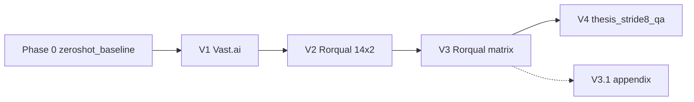

# Dann Transfer — Experiment Index

Domain-adversarial and weak-label adaptation of **UCAPS v2.9** (beef cattle castration pain) to **Holstein/Jersey dairy** farm video using weak `video_health_status` proxy labels.

## Experiment flow

| Version | README | Platform | Headline result |
|---------|--------|----------|-----------------|
| Phase 0 | [`../zeroshot_baseline/README.md`](../zeroshot_baseline/README.md) | A100 | Seq AUC ~0.53 zero-shot |
| V1 | [`V1/README.md`](V1/README.md) | Vast.ai | Pipeline validated |
| V2 | [`V2/README.md`](V2/README.md) | Rorqual | Threshold degeneracy exposed |
| V3 | [`V3/README.md`](V3/README.md) | Rorqual | **Seq AUC 0.577 (CORAL)** |
| V3.1 | [`V3.1/README.md`](V3.1/README.md) | Rorqual | Literature fork (appendix) |
| V4 | [`V4/README.md`](V4/README.md) | Rorqual | Cow bacc **0.75** on 549-seq dataset |

## Canonical code

Shared trainers live in [`code/`](code/):

- `dann_adapt_v2.9.py`, `weak_label_adapt_v2.9.py` — V1/V2
- `V3/training_code/dann_adapt_v3.py`, `weak_label_adapt_v3.py` — V3/V4
- `dann_adapt_v3_1.py`, `weak_label_adapt_v3_1.py` — V3.1 appendix

## Documentation

- [`DANN_EXPERIMENT_HISTORY.md`](DANN_EXPERIMENT_HISTORY.md) — chronological run log
- [`CHECKPOINTS_README.md`](CHECKPOINTS_README.md) — checkpoint locations
- [`../docs/literature_review.md`](../docs/literature_review.md) — related work
- [`../docs/DATA_ACCESS.md`](../docs/DATA_ACCESS.md) — sequences and weights (not in repo)

## Important limitation

All Holstein metrics use **`video_health_status`** as a weak health proxy, not veterinary pain scores. See metric-role tables in each version report.
