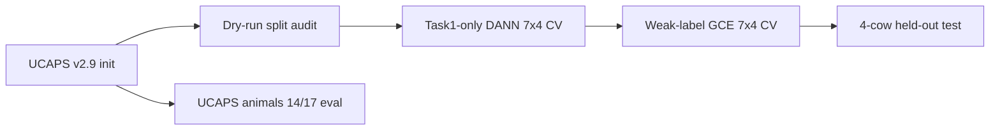

# V1 — Task1 DANN + Weak-Label GCE (Vast.ai, May 2026)

**Status:** Frozen archive · **Platform:** Vast.ai A100 · **Dataset:** [`baseline_10s_250`](../../datasets/baseline_10s_250/) (250 sequences)

V1 validated the full Holstein cow-held-out pipeline: dry-run splits, Task1-only DANN, weak-label GCE fine-tuning, and UCAPS source reference evaluation. Full incident log and per-fold tables are in [`v1.md`](v1.md).

## Pipeline

| Stage | Script | Output folder |
|-------|--------|---------------|
| Dry run | `dann_adapt_v2.9.py --dry-run` | `holstein_task1_dann_vast_run_dry_run/` |
| Task1 DANN | `dann_adapt_v2.9.py` | `holstein_task1_dann_vast_run/` |
| Weak GCE | `weak_label_adapt_v2.9.py` | `holstein_task1_weak_gce_vast_run/` |
| UCAPS reference | `evaluate_test_set_v2.9_cli.py` | `V1_artifacts_staging/ucaps_pretrained_task1_eval/` |

## Protocol

| Setting | Value |
|---------|-------|
| Inner CV | 7 folds × 4 validation cows |
| Test cows | 363, 403, 404, 408 (29 sequences) |
| Label | `video_health_status` (weak proxy) |
| DANN epochs / LR | 20 / 1e-5, domain weight 0.5 |
| Weak GCE epochs / LR | 10 / 1e-4, q=0.7 |

## Headline results (Holstein proxy, final 4-cow test)

| Model | Seq AUC | Seq balanced acc | Cow AUC | Notes |
|-------|--------:|-----------------:|--------:|-------|
| Task1 DANN | ~0.48 | ~0.50 | ~0.50 | Source sanity gate (0.7 AUC) never passed; proxy fallback used |
| Weak GCE | ~0.48 | ~0.50 | ~0.50 | Completed after `torch.load` patch |

Inner validation AUC was high on some folds (up to ~0.90) but did not reliably transfer to the tiny test set — a pattern repeated in V2 until V3 fixed thresholding.

## Key reproducibility fixes (V1)

1. Added missing `evaluate_test_set_v2.9_cli.py` to the upload bundle.
2. Patched `torch.load(..., weights_only=False)` for PyTorch 2.6 checkpoint loading (`weak_label_adapt_v2.9_patched_weights_only.py`).

## Artifacts in this folder

- `holstein_task1_dann_vast_run/` — DANN metrics, reports, fold summaries (checkpoints not in repo; see [`docs/DATA_ACCESS.md`](../../docs/DATA_ACCESS.md))
- `holstein_task1_weak_gce_vast_run/` — weak-label outputs
- `remote_*.sh` — Vast.ai launch scripts
- [`v1.md`](v1.md) — complete archive document

## Next step

→ [**V2**](../V2/README.md): expanded 14×2 CV on Rorqual; exposed threshold degeneracy (all-positive predictions).
