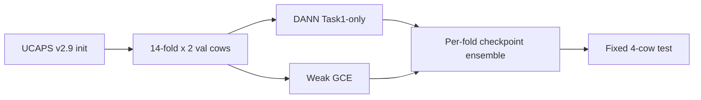

# V2 — Expanded CV on Rorqual (May 2026)

**Status:** Frozen archive · **Platform:** Alliance Rorqual (Slurm) · **Dataset:** [`baseline_10s_250`](../../datasets/baseline_10s_250/)

V2 doubled inner-fold count (14×2 validation cows vs V1's 7×4) while keeping the same four test cows. The run completed successfully but revealed **threshold degeneracy**: validation-mean thresholds predicted all test sequences as positive.

Extended protocol notes: [`v2.md`](v2.md) · Run snapshot: [`rorqual_run_20260508/`](rorqual_run_20260508/)

## Pipeline



## Protocol change vs V1

| Setting | V1 | V2 |
|---------|----|----|
| Val cows per fold | 4 | **2** |
| Inner folds | 7 | **14** |
| Test cows | 363, 403, 404, 408 | Same |
| Threshold | Mean per-fold best | Mean per-fold best (**degenerate**) |

## Headline results (job completed ~9h18, May 2026)

| Model | Seq AUC | Seq F1 @ val threshold | Cow AUC | Threshold issue |
|-------|--------:|----------------------:|--------:|-----------------|
| DANN | **0.558** | 0.619 (all positive) | 0.500 | tn=0, fp=16, fn=0, tp=13 |
| Weak GCE | **0.476** | 0.619 (all positive) | 0.500 | Same degeneracy |

Mean inner-fold val AUC ≈ **0.77** for both models — high validation, poor calibrated test separation.


## Canonical results location

```
rorqual_run_20260508/
├── dann_sbatch/          # DANN reports, CSVs, diagnostics
├── weak_gce_sbatch/      # Weak GCE reports, CSVs, diagnostics
├── results/              # Quick-access report copies
└── training_code/        # Code snapshot for this protocol
```

Checkpoints (`fold_*/best_*.pt`) are excluded from GitHub; see [`docs/DATA_ACCESS.md`](../../docs/DATA_ACCESS.md).

## Diagnosis

The validation-mean threshold policy collapsed because several folds had extreme thresholds and tiny validation sets (2 cows). **V3** addressed this with 7×4 folds, pooled validation thresholding, and a minimum specificity constraint.

## Launch scripts

- `sbatch_task1_rorqual.sh` — full DANN + weak GCE training
- `run_eval_only_rorqual.sh` — regenerate reports from saved checkpoints

## Next step

→ [**V3**](../V3/README.md): protocol redesign + 8-condition baseline matrix; best seq AUC **0.577 (CORAL)**.
