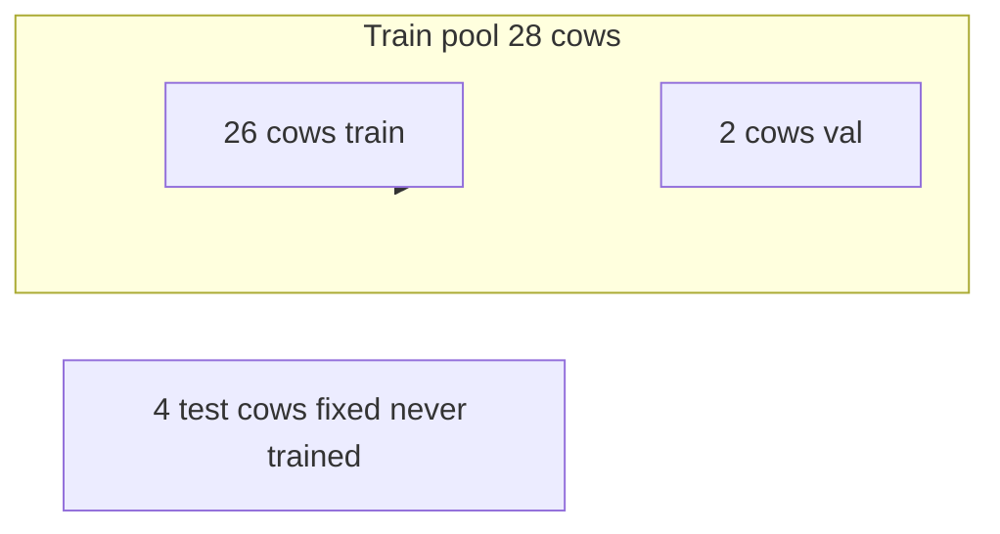

# Holstein: 2-cow CV, fixed test set, temporal density, diagnostics

**Source:** Cursor plan *Holstein CV and diagnostics* (2026). Implementation phases beyond Phase 1 may still be pending—see [README.md](README.md).

## Constraints (locked in)

- **No additional welfare labels** — all improvements use **dataset preparation**, **sampling**, **architecture/inference**, **CV protocol**, and **reporting**.
- **Test set:** **Same four cows as V1**, never in any fold’s training: **`363,403,404,408`** — pass explicitly as `--test-cow-ids` so runs stay comparable to [../V1/v1.md](../V1/v1.md).
- **Inner CV:** From the remaining **28 cows**, **2 cows per fold for validation** ⇒ **14 folds** (since `28 / 2 = 14`). Training each fold uses **26 cows** (+ source UCAPS as today).

## What already exists vs what to change

| Piece | Today | Target |
|-------|--------|--------|
| Stratified cow folds | [`_make_validation_folds`](../weak_label_adapt_v2.9.py) balances cow-level proxy labels across folds | Keep; use **`--val-cows-per-fold 2`** (divides 28 evenly → 14 folds). Divisibility error text updated for generic `28 % val_cows_per_fold`. |
| Test isolation | [`_build_split_plan`](../weak_label_adapt_v2.9.py) removes test cows from train pool | Add **`--test-cow-ids 363,403,404,408`** in [run_task1_vast.sh](run_task1_vast.sh) (and weak stage) for reproducibility. |
| “Every second / all pixels” | [`FacialPainDataset`](../v2.9_training_classification.py): **`max_frames` default 32**, train uses jittered indices, val/test **deterministic linspace** over on-disk frames | **Phase A:** raise `--max_frames` (e.g. 64 → 128) + smaller batch / AMP as needed. **Phase B (optional code):** multi-clip **sliding windows** at inference (overlap windows, aggregate logits/probs). |
| Video-level score | LSTM over frames → clip logits; reports aggregate to cow | Keep clip-level outputs; add explicit **aggregation exports**: mean / max / weighted-by-attention (if added later). |
| Confidence / diagnostics | Probabilities + temperature scaling in summaries | Extend exports: **entropy**, **margin** (top-2 prob gap), **ECE**, **Brier**, **reliability bins**, optional **MC dropout** variance at test. |

## Phase 1 — Protocol and scripts (low risk)

1. Set **`--val-cows-per-fold 2`** for both `dann_adapt_v2.9.py` and `weak_label_adapt_v2.9.py` invocations in [run_task1_vast.sh](run_task1_vast.sh).
2. Add **`--test-cow-ids 363,403,404,408`** alongside **`--test-cows 4`** so test cows are **exactly** V1’s set.
3. Patch divisibility **error text** in [`weak_label_adapt_v2.9.py`](../weak_label_adapt_v2.9.py) (done in repo root).
4. **Cost note:** 14 folds vs 7 **doubles** inner-fold training time — budget GPU accordingly.

## Phase 2 — Temporal density without new labels

5. **Sweep `--max_frames`** via [`_apply_cfg_overrides`](../dann_adapt_v2.9.py) (`--max_frames` already plumbed). Start conservative (e.g. 64), watch VRAM, pair with **`--batch-size`** reduction.
6. **Resolution trade:** higher `max_frames` may conflict with high resolution; keep dataset linspace behavior so val/test remain deterministic.
7. **Optional inference-only densification:** **sliding-window clip scoring** (multiple spans per sequence → aggregate logits/probs).

## Phase 3 — Diagnostics

8. **Per-row export:** logits, **entropy**, **confidence_margin** (optional `mc_std`).
9. **Summary JSON / MD:** **ECE**, **Brier**, **calibration bins**, **NLL**; bootstrap CIs on cow-level metrics where feasible.
10. **Threshold diagnostics:** store **full precision–recall curve** on validation.

## Phase 4 — What we are not claiming

- Proxy labels remain **not** pain ground truth.
- With **4 fixed test cows**, absolute AUC stays noisy; **14-fold inner CV** stabilizes model selection.

## Implementation order

1. Script args: `val_cows_per_fold=2`, `test_cow_ids` fixed, error message fix.
2. Baseline run at current `max_frames` to verify 14-fold plumbing.
3. `max_frames` / batch sweep + optional sliding-window eval.
4. Diagnostic columns + calibration metrics in export/report writers.
