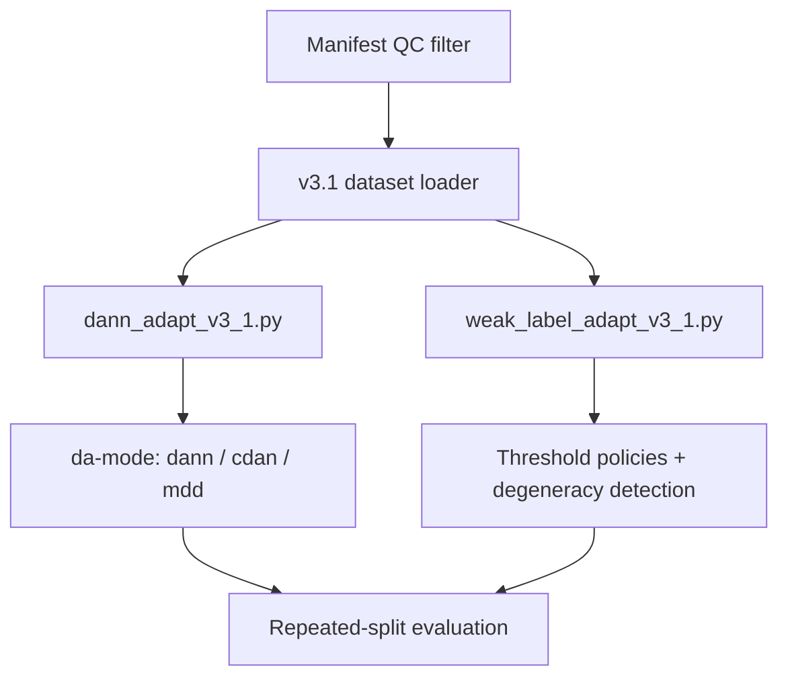

# V3.1 — Literature-Aligned Experimental Fork (Appendix)

**Status:** Parallel research track · **Not part of the main V1→V4 thesis line**

V3.1 explores literature-aligned upgrades (CDAN-style conditioning, MDD-inspired heads, explicit threshold policies, manifest QC) in forked trainers **`dann_adapt_v3_1.py`** and **`weak_label_adapt_v3_1.py`**. V2/V3 canonical scripts are unchanged.

Full design notes: [`V3.1.md`](V3.1.md) · Plan: [`holstein_cv_v31_plan.md`](holstein_cv_v31_plan.md)

## Pipeline



## Code layout

| Path | Role |
|------|------|
| [`../code/dann_adapt_v3_1.py`](../code/dann_adapt_v3_1.py) | DANN fork with `--da-mode`, warmup/ramp schedules |
| [`../code/weak_label_adapt_v3_1.py`](../code/weak_label_adapt_v3_1.py) | Weak-label fork with `--test-threshold-policy` |
| [`../code/holstein_eval_thresholds.py`](../code/holstein_eval_thresholds.py) | Shared threshold / degeneracy helpers |
| [`../code/holstein_v31_dataset.py`](../code/holstein_v31_dataset.py) | QC-filtered manifest loader |
| [`filter_manifest_qc.py`](filter_manifest_qc.py) | Offline QC → `completed_manifest_v3_1.csv` |
| [`run_task1_v3_1.sh`](run_task1_v3_1.sh) | Launcher |
| [`sbatch_task1_v3_1_rorqual.sh`](sbatch_task1_v3_1_rorqual.sh) | Slurm template |

## Relation to main line

| | Main line (V3) | V3.1 appendix |
|---|----------------|---------------|
| Trainers | `dann_adapt_v3.py` | `dann_adapt_v3_1.py` |
| Thresholding | Pooled val, spec ≥ 0.5 | Multiple explicit policies |
| Domain adapt | CORAL + DANN sweep | CDAN / MDD options |
| Thesis claim | Primary results | Exploratory / literature alignment |

## Results folders

- `holstein_task1_dann_v31_run_sbatch/` — DANN v3.1 Slurm outputs (metrics/reports in repo; checkpoints excluded)
- `holstein_task1_weak_gce_v31_run_sbatch/` — weak-label v3.1 outputs

## Quick start

```bash
bash V3.1/run_task1_v3_1.sh
```

Optional CDAN:

```bash
export EXTRA_DANN_ARGS="--da-mode cdan --domain-warmup-epochs 3 --domain-ramp-epochs 10"
bash V3.1/run_task1_v3_1.sh
```

## Main thesis results

For the primary experiment narrative, see [**V3**](../V3/README.md) (baseline matrix) and [**V4**](../V4/README.md) (thesis_stride8_qa dataset).
