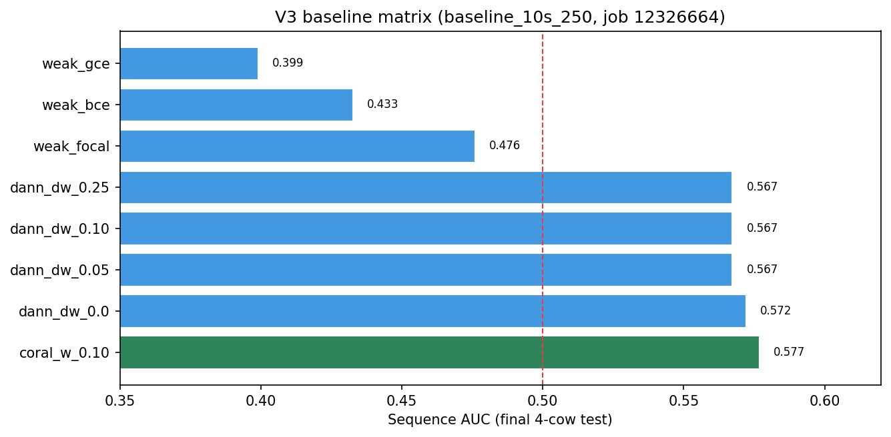

# V3 — Protocol Redesign + Baseline Matrix (Rorqual, May 2026)

**Status:** Primary baseline matrix · **Job:** 12326664 · **Dataset:** [`baseline_10s_250`](../../datasets/baseline_10s_250/)

V3 fixed V2's threshold degeneracy with 7×4 class-supported folds, pooled validation thresholding (specificity ≥ 0.5), and source-retained DANN/CORAL training. Best sequence AUC: **0.577 (CORAL)**.

## Results at a glance



| Best metric | Condition | Value |
|-------------|-----------|------:|
| Sequence AUC | `coral_w_0.10` | **0.577** |
| Spec-constr. balanced acc | `weak_focal` | **0.637** |
| Calibrated cow bacc | DANN family | **0.750** |

Thesis dense-dataset follow-up → [**V4**](../V4/README.md).

---

# V3 Stable Cow-Level Transfer Plan

V3 is an isolated implementation branch. It copies the Rorqual V2 training snapshot into `V3/training_code/` and changes only V3 files.

## Why V3 Exists

Rorqual V2 repeated the earlier V1 failure mode:

| Run | Dataset | Protocol | Final sequence AUC | Final cow AUC | Balanced accuracy | Threshold behavior |
|---|---:|---|---:|---:|---:|---|
| V2 DANN Rorqual | baseline_10s_250 | 14 folds x 2 val cows | 0.5577 | 0.5000 | 0.5000 | all positive |
| V2 weak GCE Rorqual | baseline_10s_250 | 14 folds x 2 val cows | 0.4760 | 0.5000 | 0.5000 | all positive |
| V1 / Vast weak and DANN family | baseline_10s_250 | mixed 7/14 fold diagnostics | about 0.47-0.56 | unstable | 0.5000 common | frequent all positive |

The practical issue is not just model family. The weak target label is `video_health_status`, not veterinary pain ground truth, and the old validation design often produced tiny or single-class validation folds. V3 therefore changes the experiment order before adding complexity:

- use 7 folds x 4 validation cows as the primary split;
- require both proxy classes in every validation fold;
- select checkpoints with a cow-aware composite score;
- choose the final threshold from pooled out-of-fold validation predictions with a minimum specificity constraint;
- gate DANN checkpoints by relative UCAPS source Task1 retention, while still reporting the old 0.70 AUC marker;
- keep `baseline_10s_250` and `dense_10s_stride5_qa` results separate.

## Literature Addendum

V3 follows the prior `literature_review.md` and adds these operational choices:

- DANN should retain source discrimination, not only reduce domain separability (Ganin et al., 2016, JMLR).
- Conditional/adversarial alignment can help but should be compared with simpler covariance alignment such as Deep CORAL (Long et al., 2018, NeurIPS; Sun and Saenko, 2016, ECCV Workshops).
- Cow-level robustness needs group-aware validation and reporting, consistent with group robustness concerns formalized by group DRO (Sagawa et al., 2020, ICLR).
- Weak target labels require noisy-label losses and calibrated thresholds, not deployment claims (Zhang and Sabuncu, 2018, NeurIPS; Guo et al., 2017, ICML; Kull et al., 2017, AISTATS).
- Candidate veterinary scoring should prioritize uncertainty and disagreement under diversity constraints (Gal et al., 2017, ICML).

Current Holstein/Jersey metrics remain weak health-proxy metrics. Only a blinded veterinary-scored target set can support a target-domain pain claim.

## Files

| Path | Purpose |
|---|---|
| `training_code/weak_label_adapt_v3.py` | Cow-balanced weak-label training, QA audit, 7x4 class-supported splits, pooled specificity-constrained thresholding. |
| `training_code/dann_adapt_v3.py` | Source-retained DANN with optional `--alignment-loss coral`. |
| `training_code/ssl_pretrain_holstein_v3.py` | SimSiam wrapper that defaults to fold-train cows only. |
| `training_code/select_calibration_candidates_v3.py` | Selects 50 vet-scoring candidates by uncertainty, disagreement, cow/condition/source diversity. |
| `data_code/create_dense_10s_face_sequences_v3.py` | Creates the planned dense 10s stride-5 QA-filtered dataset. |
| `run_v3_baseline_matrix_rorqual.sh` | Primary baseline_10s_250 matrix. |
| `run_v3_dense_matrix_rorqual.sh` | Dense-dataset build and best-setting rerun. |
| `run_v3_eval_only_rorqual.sh` | Regenerates reports from saved checkpoints. |

## Primary Run Order

1. Baseline split/QA dry runs:

```bash
RUN_WEAK=0 RUN_DANN=0 RUN_CORAL=0 bash V3/run_v3_baseline_matrix_rorqual.sh
```

2. Baseline weak-label matrix:

```bash
RUN_WEAK=1 RUN_DANN=0 RUN_CORAL=0 bash V3/run_v3_baseline_matrix_rorqual.sh
```

3. Baseline source-retained DANN sweep:

```bash
RUN_WEAK=0 RUN_DANN=1 RUN_CORAL=1 bash V3/run_v3_baseline_matrix_rorqual.sh
```

4. Optional fold-train-only SSL, then rerun the best weak and DANN settings:

```bash
RUN_SSL=1 RUN_WEAK=1 RUN_DANN=1 RUN_CORAL=0 bash V3/run_v3_baseline_matrix_rorqual.sh
```

5. Build dense QA data and run only best settings:

```bash
bash V3/run_v3_dense_matrix_rorqual.sh
```

6. Select veterinary scoring candidates:

```bash
python V3/training_code/select_calibration_candidates_v3.py \
  --predictions-csv /scratch/shiv136/project_data/runs/v3_baseline_10s_250/weak_gce/weak_label_cv_test_predictions.csv \
  --predictions-csv /scratch/shiv136/project_data/runs/v3_baseline_10s_250/dann_dw_0.10/dann_test_predictions.csv \
  --n 50 \
  --out-csv /scratch/shiv136/project_data/runs/v3_vet_scoring_candidates.csv
```

## Smoke Tests

Weak:

```bash
python V3/training_code/weak_label_adapt_v3.py --dry-run \
  --manifest-csv /scratch/shiv136/project_data/cow_face_sequences_10s_250/completed_manifest.csv \
  --sequence-root /scratch/shiv136/project_data/cow_face_sequences_10s_250 \
  --test-cow-ids 363,403,404,408 --val-cows-per-fold 4
```

DANN:

```bash
python V3/training_code/dann_adapt_v3.py --dry-run \
  --manifest-csv /scratch/shiv136/project_data/cow_face_sequences_10s_250/completed_manifest.csv \
  --sequence-root /scratch/shiv136/project_data/cow_face_sequences_10s_250 \
  --source-project-dir /scratch/shiv136/project_data/ucaps_source \
  --source-sequence-dir /scratch/shiv136/project_data/ucaps_source/sequence \
  --test-cow-ids 363,403,404,408 --val-cows-per-fold 4
```

One-fold smoke:

```bash
python V3/training_code/weak_label_adapt_v3.py --fold 0 --num-epochs 1 --max-train-batches 2 --max-val-batches 2 ...
python V3/training_code/dann_adapt_v3.py --fold 0 --num-epochs 1 --max-train-batches 2 --max-val-batches 2 ...
```

## Interpretation Rules

- Report `dataset_version` in every table: `baseline_10s_250` or `dense_10s_stride5_qa`.
- Treat all Holstein/Jersey labels as weak health proxies unless the row comes from a blinded veterinary scoring set.
- A V3 DANN checkpoint is primary only if source Task1 AUC is retained: `source_task1_auc >= max(0.55, source_task1_auc_init - 0.03)`.
- The old `source_task1_auc >= 0.70` marker is still reported but is not the only gate.
- If the specificity-constrained validation threshold still gives all-positive final predictions, the report should be read as a negative proxy-transfer result, not as a deployable detector.

## Baseline matrix results (Rorqual, job 12326664, 2026-05-14 → 2026-05-15)

**Local mirror:** [`rorqual_run_20260515_12326664/`](rorqual_run_20260515_12326664/) — **298 files**, all **8 trainable conditions** with **7 folds** each, reports, CSVs, JSON, and checkpoints. Slurm logs: [`slurm_logs/ucaps_v3_base-12326664.out`](rorqual_run_20260515_12326664/slurm_logs/ucaps_v3_base-12326664.out).

| Check | Value |
|------|--------|
| Slurm job ID | `12326664` |
| State / exit | `COMPLETED`, `ExitCode 0:0` |
| Wall time | **15h 31m** |
| Conditions synced | `weak_{bce,gce,focal}`, `dann_dw_{0.0,0.05,0.10,0.25}`, `coral_w_0.10` (+ dry-run dirs) |

### Protocol (all 8 conditions)

| Item | Value |
|------|--------|
| `dataset_version` | `baseline_10s_250` |
| Label | `video_health_status` (weak proxy) |
| Inner CV | **7 folds × 4 validation cows**, both classes required |
| Final test cows | `363`, `403`, `404`, `408` (29 sequences) |
| Threshold | Pooled validation, **specificity ≥ 0.5** when feasible (V3 primary policy) |
| Epochs | 80 per condition |

### Final held-out test — all 8 conditions (from synced `*_report.md`)

Primary row = **reported threshold** (V3 specificity-constrained policy where applicable). All metrics are **proxy-label** only.

| Condition | Mean val AUC | Seq AUC | Seq bacc | Seq F1 | Seq recall | Spec-constr. bacc | Cow AUC | Cow bacc | Cal. cow bacc | Cal. cow F1 |
|-----------|-------------:|--------:|---------:|-------:|-----------:|------------------:|--------:|---------:|--------------:|------------:|
| `weak_bce` | 0.691 | 0.433 | 0.445 | 0.118 | **0.077** | 0.567 | 0.500 | 0.500 | 0.500 | 0.500 |
| `weak_gce` | 0.706 | 0.399 | 0.445 | 0.118 | **0.077** | 0.505 | 0.500 | 0.500 | 0.500 | 0.667 |
| `weak_focal` | 0.701 | 0.476 | 0.426 | 0.452 | 0.538 | **0.637** | 0.500 | 0.500 | 0.500 | 0.667 |
| `dann_dw_0.0` | 0.639 | 0.572 | 0.488 | 0.483 | 0.538 | 0.575 | 0.500 | **0.750** | **0.750** | **0.800** |
| `dann_dw_0.05` | 0.641 | 0.567 | 0.488 | 0.483 | 0.538 | 0.567 | 0.500 | **0.750** | **0.750** | **0.800** |
| `dann_dw_0.10` | 0.646 | 0.567 | 0.495 | 0.516 | 0.615 | 0.567 | 0.500 | **0.750** | **0.750** | **0.800** |
| `dann_dw_0.25` | 0.646 | 0.567 | 0.481 | 0.444 | 0.462 | 0.567 | 0.500 | **0.750** | **0.750** | **0.800** |
| **`coral_w_0.10`** | 0.639 | **0.577** | **0.512** | 0.462 | 0.462 | 0.575 | 0.500 | 0.500 | **0.750** | **0.800** |

**Best in this matrix (final test, conservative reading):**

- **Highest sequence AUC:** `coral_w_0.10` (**0.577**) — above V2 DANN (0.558) and V2 weak GCE (0.476) on the same cows.
- **Highest specificity-constrained balanced accuracy:** `weak_focal` (**0.637**).
- **Best calibrated cow-level balanced accuracy / F1:** DANN family (**0.75 / 0.80**) — but cow AUC remains **0.50** (n=4 cows).
- **Broken “all-positive” degeneracy:** V3 weak runs no longer show recall=1.0 at the primary threshold (V2/V3.1 did).

### What worked vs what did not (V3-specific)

**Worked**

1. **Protocol redesign:** 7×4 class-supported folds; inner validation AUC **0.69–0.71** (weak) vs **0.64–0.65** (DANN/CORAL) on average.
2. **Threshold policy:** specificity constraint met on all conditions; predictions are **not** all-positive at the primary threshold.
3. **DANN source retention (relative):** `retention_pass=True` throughout training; `source_auc` ~0.59–0.62 vs init ~0.572.
4. **CORAL alignment:** best **sequence-level** ranking in this matrix (AUC 0.577).

**Did not work (for deployment claims)**

1. **Legacy 0.70 source floor:** `abs70_pass=False` on every DANN/CORAL fold — no epoch met the old UCAPS sanity bar.
2. **Cow-level final test:** AUC **0.50** for almost all conditions (only 4 cows — high variance).
3. **Weak-only primary threshold:** very low recall (~8%) for BCE/GCE despite decent inner CV — thresholding still harsh on the tiny test set.
4. **No pain ground truth:** all numbers are **`video_health_status` proxy** metrics only.

### Comparison to V2 (same dataset, different CV)

| Track | CV | Best prior seq AUC (V2) | Best V3 seq AUC | Notes |
|-------|-----|------------------------:|----------------:|-------|
| DANN | 14×2 (V2) vs 7×4 (V3) | 0.558 | **0.577** (CORAL) | V3 fixes all-positive; modest AUC gain |
| Weak GCE | 14×2 vs 7×4 | 0.476 | 0.476 (focal) | Similar ranking; V3 threshold policy differs |

Per-condition reports: [`rorqual_run_20260515_12326664/v3_baseline_10s_250/`](rorqual_run_20260515_12326664/v3_baseline_10s_250/) (`*_report.md`, `*_fold_summary.csv`, `*_diagnostics.json`).

## Next Actions

1. ~~Run the baseline V3 matrix.~~ **Done** (job `12326664`).
2. ~~Copy results locally.~~ **Done** — see [`rorqual_run_20260515_12326664/`](rorqual_run_20260515_12326664/).
3. Pick **best weak** (`weak_focal` on spec-constr. bacc) + **best alignment** (`coral_w_0.10` on seq AUC) for dense-dataset rerun.
4. Run `run_v3_dense_matrix_rorqual.sh` (dense QA build + best-setting rerun only).
5. Run `select_calibration_candidates_v3.py` on chosen test prediction CSVs for vet-scoring shortlist.
