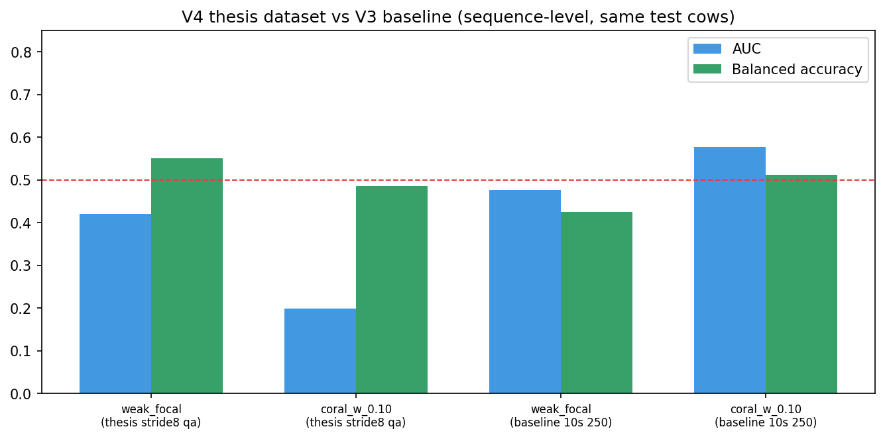
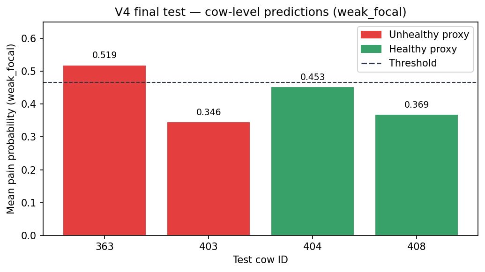
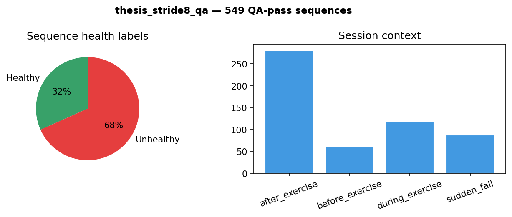

# V4 — Thesis Stride-8 Sequence Dataset Results

V4 packages the first full transfer-learning evaluation on the **thesis_stride8_qa** face-sequence dataset: dense 10-second windows with 8-second stride, QA-filtered, trained with the V3 cow-held-out protocol on Alliance Rorqual (Slurm job **13253646**).

This folder is the thesis-facing snapshot: dataset statistics, both training conditions, sequence/video/cow-level metrics, and comparison against the frozen **baseline_10s_250** V3 matrix.

## Results at a glance







| Condition | Seq AUC | Cow balanced acc | Outcome |
|-----------|--------:|-----------------:|---------|
| **weak_focal** | 0.421 | **0.750** | Best on thesis data |
| coral_w_0.10 | 0.199 | 0.500 | CORAL collapsed on dense data |

---

## What changed from V3 baseline

| Aspect | V3 baseline (`baseline_10s_250`) | V4 (`thesis_stride8_qa`) |
|--------|----------------------------------|---------------------------|
| Sequences | 250 | **549** (+120%) |
| Windowing | Non-overlapping 10 s clips | **10 s window, 8 s stride** (2 s overlap) |
| Unique cows in pool | 32 | **31** (cow 409 excluded) |
| CV folds | 7 × 4 val cows | **9 × 3 val cows** (31 cows → 27 train pool) |
| Test cows | 363, 403, 404, 408 | Same |
| Evaluation levels | Sequence + cow | **Sequence + video + cow** |
| Label | `video_health_status` weak proxy | Same |

**Important:** labels are still `video_health_status` (healthy vs unhealthy exercise context), not veterinary pain scores. All metrics below are proxy-label diagnostics only.

---

## Dataset summary (`dataset/processing_statistics.json`)

| Stat | Value |
|------|------:|
| QA-pass sequences | 549 |
| Unique cows represented | 31 |
| Healthy / unhealthy sequences | 174 / 375 |
| Healthy / unhealthy cows | 15 / 17 |
| Source videos selected | 92 (3 per cow target, seed 42) |
| Candidate windows | 900 |
| Rejected by QA | 332 |
| Session mix | before 62 · during 119 · after 281 · sudden_fall 87 |
| Sources | Truro 196 · Yashan RAC 266 · Cow 349 fall 87 |

Partial cows (fewer than 3 videos): **352, 363, 428**.

Unhealthy definition for thesis extraction: during/after exercise clips plus cow **349** (sudden fall) only.

---

## Training conditions (both run on Rorqual)

| Condition | Script | Key settings |
|-----------|--------|--------------|
| **weak_focal** | `weak_label_adapt_v3.py` | Focal loss, init from UCAPS v2.9 Task1 checkpoint, 80 epochs |
| **coral_w_0.10** | `dann_adapt_v3.py` | CORAL alignment weight 0.1, source Task1 retention gate, 80 epochs |

Shared protocol:
- 9 inner folds × 3 validation cows, both classes required per fold
- Final test: cows **363, 403, 404, 408** (27 sequences, 7 source videos)
- Threshold from pooled validation (Youden / balanced accuracy, specificity ≥ 0.5)
- Temperature scaling reported separately (calibrated tables in reports)

Reproduction scripts: `scripts/run_v3_thesis_stride8_rorqual.sh`, `scripts/sbatch_v3_thesis_stride8_rorqual.sh`.

---

## Final test results (primary threshold policy)

Metrics use the **specificity-constrained pooled validation threshold** unless noted.

### weak_focal — best overall on thesis data

| Level | n | AUC | Balanced acc | F1 | Threshold |
|-------|--:|----:|-------------:|---:|----------:|
| Sequence | 27 | 0.421 | 0.551 | 0.480 | 0.465 |
| Video | 7 | 0.417 | 0.542 | 0.400 | 0.465 |
| **Cow** | **4** | **0.500** | **0.750** | **0.667** | 0.465 |

Per-cow mean pain probability (weak_focal):

| Cow | Label | n seq | pain_prob | Correct at 0.465? |
|-----|-------|------:|----------:|:------------------:|
| 363 | Unhealthy | 6 | 0.519 | Yes |
| 403 | Unhealthy | 10 | 0.346 | No (below threshold) |
| 404 | Healthy | 5 | 0.453 | Yes |
| 408 | Healthy | 6 | 0.369 | Yes |

Cow-level bootstrap 95% AUC CI (4 cows): **[0.0, 1.0]** — too few animals for stable AUC estimates.

### coral_w_0.10 — degraded on dense thesis data

| Level | n | AUC | Balanced acc | F1 | Threshold |
|-------|--:|----:|-------------:|---:|----------:|
| Sequence | 27 | 0.199 | 0.486 | 0.111 | 0.500 |
| Video | 7 | 0.167 | 0.375 | 0.000 | 0.500 |
| Cow | 4 | 0.000 | 0.500 | 0.000 | 0.500 |

CORAL probabilities collapsed near **0.41–0.47** for all test cows (healthy and unhealthy), indicating failed proxy separation despite strong inner-fold validation AUC on some folds (e.g. cow 349 validation).

---

## Comparison vs V3 baseline (`baseline_10s_250`, job 12326664)

Full table: `analysis/comparison_vs_baseline.csv`.

| Condition | Dataset | Seq AUC | Seq bacc | Cow bacc | Direction vs baseline |
|-----------|---------|--------:|---------:|---------:|-----------------------|
| weak_focal | thesis_stride8_qa | 0.421 | 0.551 | **0.750** | Cow bacc ↑; seq AUC ↓ |
| weak_focal | baseline_10s_250 | 0.476 | 0.426 | 0.500 | — |
| coral_w_0.10 | thesis_stride8_qa | 0.199 | 0.486 | 0.500 | Large seq AUC ↓ |
| coral_w_0.10 | baseline_10s_250 | **0.577** | 0.512 | 0.500 | Best baseline seq AUC |

**Takeaways**

1. **More sequences did not improve sequence AUC** on the fixed 4-cow test set; overlap and label noise may increase difficulty.
2. **weak_focal gained cow-level balanced accuracy (0.75 vs 0.50)** — the clinically relevant aggregation — even with lower sequence AUC.
3. **CORAL DANN did not transfer** to the dense thesis dataset; baseline CORAL remains the best sequence-level method on sparse 250-seq data.
4. Inner validation is **highly fold-dependent** (val AUC from 0.40 to 0.99), so pooled thresholding is essential; single-fold numbers are not deployable metrics.
5. Test set remains **tiny** (4 cows, 27 sequences); treat all conclusions as exploratory.

---

## Validation fold snapshot

Mean inner-fold Holstein proxy val AUC (9 folds):

| Condition | Mean val AUC | Min | Max |
|-----------|-------------:|----:|----:|
| weak_focal | 0.795 | 0.508 | 0.998 |
| coral_w_0.10 | 0.716 | 0.400 | 0.984 |

High validation scores on folds containing cow **349** (87 sudden-fall sequences) inflate pooled validation; final test excludes 349.

---

## Folder layout

```
V4/
├── README.md                          ← this file
├── dataset/
│   └── processing_statistics.json     ← thesis_stride8_qa build stats
├── analysis/
│   ├── comparison_vs_baseline.csv     ← headline metrics vs baseline_10s_250
│   └── run_metadata.json              ← job IDs, paths, protocol
├── results/
│   ├── weak_focal/                    ← weak-label transfer (best on thesis data)
│   │   ├── weak_label_cv_report.md    ← full human-readable report
│   │   ├── weak_label_cv_summary.json
│   │   ├── weak_label_cv_fold_summary.csv
│   │   ├── weak_label_cv_test_predictions.csv
│   │   ├── weak_label_cv_test_video_aggregates.csv
│   │   ├── weak_label_cv_test_cow_aggregates.csv
│   │   ├── weak_label_cv_test_calibrated_*_aggregates.csv
│   │   └── weak_label_cv_diagnostics.json
│   └── coral_w_0.10/                  ← CORAL DANN transfer
│       ├── dann_report.md
│       ├── dann_summary.json
│       ├── dann_fold_summary.csv
│       ├── dann_test_predictions.csv
│       ├── dann_test_video_aggregates.csv
│       ├── dann_test_cow_aggregates.csv
│       ├── dann_test_calibrated_*_aggregates.csv
│       └── dann_diagnostics.json
└── scripts/
    ├── run_v3_thesis_stride8_rorqual.sh
    ├── sbatch_v3_thesis_stride8_rorqual.sh
    └── summarize_thesis_results.py
```

---

## How to regenerate the comparison table

From `Dann transfer/` (needs V3 baseline summaries at `V3/rorqual_run_20260515_12326664/v3_baseline_10s_250/`):

```bash
python V4/scripts/summarize_thesis_results.py
```

Or read `results/*/weak_label_cv_report.md` and `results/*/dann_report.md` directly.

---

## Limitations and next steps

- **Proxy labels only** — `video_health_status` mixes lameness, exercise timing, and fall events; not vet-scored pain.
- **Fixed 4-cow test** — same as V3 for comparability; bootstrap CIs are extremely wide.
- **No checkpoints in this folder** — fold checkpoints remain on Rorqual under `/scratch/shiv136/project_data/runs/v3_thesis_stride8_qa/fold_*/`.
- **CORAL failure on dense data** — suggests re-tuning domain weight or trying weak-label-only / CDAN on thesis sequences before claiming adaptation gains.

Suggested follow-ups: veterinary-scored subset (V3 calibration candidate pipeline), repeated splits with more test cows, and threshold-free metrics (AUC/ECE) emphasized over F1 at a single threshold.

---

## Provenance

| Item | Location |
|------|----------|
| Sequence extraction | `Transferlearning/cow_face_sequences_thesis_stride8/` |
| Training code | `Transferlearning/Dann transfer/V3/training_code/` |
| Raw Rorqual download source | `V3/rorqual_run_thesis_stride8_qa/` (mirrored here) |
| Prior baseline matrix | `V3/rorqual_run_20260515_12326664/v3_baseline_10s_250/` |
| Slurm job | 13253646 (success after fixing `VAL_COWS_PER_FOLD=3`) |

Generated for thesis documentation — May 2026.
