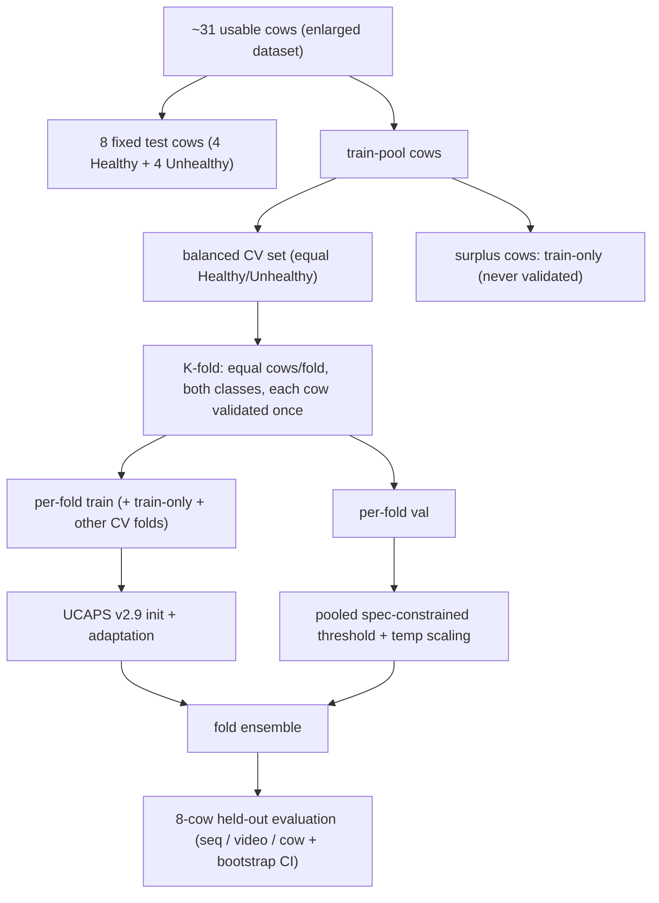

# V5 — Transfer-Learning Strategy: 8-Cow Test, Balanced CV, Micro-Expression-Informed

V5 is the **strategy and protocol redesign** that turns the weak V1–V4 transfer results into a defensible thesis experiment program. It does three things:

1. **Re-baselines** every method on the **new complete v2.9 checkpoint set** (`v2.9_20260502_181533`, all 9 folds × {combined, task1, task2}; no missing files).
2. **Enlarges the dataset** and replaces the fragile 4-cow test with an **8-cow held-out test** plus a **class-balanced cow-held-out K-fold** where every training cow is validated exactly once.
3. **Sequences a full experiment ladder** (S0–S10) from zero-shot through domain alignment, weak-label robustness, SSL, few-shot probes, temporal pooling, calibration, a literature-grounded **stretch micro-expression arm** targeting eyebrow (orbital) tightening and muzzle tension, and a **condition-stratified analysis** that exploits the disease-condition labels we actually have.

> **Scope note (no veterinary pain scores).** We do **not** have veterinary pain scores — only herd **disease-condition labels** (`video_health_status` Healthy/Unhealthy, and `health_condition`: lameness, mastitis, metritis, fresh cows, sudden fall, healthy). V5 therefore studies **transfer of a pain-trained facial model to disease-context discrimination**, not pain detection. Two label tracks are used: (a) the binary `video_health_status` proxy (comparable to V1–V4), and (b) a **focused lameness-vs-healthy proxy** — lameness is the most facial-pain-relevant condition and the closest signal to pain available without new labels. No pain or pain-adjacent label is claimed; only UCAPS source metrics use true pain ground truth.

**549-seq interim results (S3 + S4 complete):** full analysis in **[`v5.md`](v5.md)** — S3 weak-label heads fail (~0.48 AUC); **S4 DANN/CORAL reach ~0.593 seq AUC** (beats zero-shot ~0.529); best operational F1 at **DANN dw=0.25**. Raw reports: [`results/549_interim/`](results/549_interim/) · JSON summary: [`results/v5_results_analysis.json`](results/v5_results_analysis.json).

**732-seq** enlarged matrix: submit after scratch upload (`v5_thesis_732_8cow`). **S2** zero-shot on the same 8 cows: still pending.

**Charts:** open `v5-549-interim-results.canvas.tsx` in Cursor (Canvases panel) after cloning — lives in your Cursor project `canvases/` folder locally.

---

## Why V5 (what V1–V4 taught us)

| Lesson from V0–V4 | V5 response |
|-------------------|-------------|
| Zero-shot ≈ chance (video-proxy AUC 0.529; Healthy vs Unhealthy `pain_prob` differ ~0.006) | Re-measure honest floor on the new split (S2); never claim transfer without beating it |
| Threshold collapse: validation-mean thresholds → all-positive test (recall 1.0, tn 0, bacc 0.5) in V1/V2/V3.1 | Keep V3 **pooled, specificity-constrained (spec ≥ 0.5)** thresholds everywhere |
| Best seq AUC = **CORAL 0.577** on sparse 250-seq; DANN gave better cow calibration | Carry CORAL + DANN forward, but **gate on source retention** and add warmup |
| **CORAL collapsed to 0.199** on dense V4 data (covariance alignment broke on redundant, cow-imbalanced windows) | CORAL **weight sweep + warmup/ramp** (S4); cow-balanced sampling + per-cow cap (S0/S3) |
| 4-cow test → every cow-AUC CI = [0, 1]; inner val inflated by cow **349** (87 sudden-fall seqs) | **8-cow balanced test** + balanced CV; cap 349; report bootstrap CIs |
| Full fine-tune overfit (0.457) vs frozen-CNN (0.548) | Default **freeze CNN**; full FT only as a labelled ablation |
| Proxy labels cap pain claims; no vet scores exist | Reframe as **disease-context discrimination**; add **condition-stratified analysis + lameness-vs-healthy** focused proxy (S10) |

Full chronology: [`../DANN_EXPERIMENT_HISTORY.md`](../DANN_EXPERIMENT_HISTORY.md). Master overview: [`../../CowPain Transfer.md`](../../CowPain%20Transfer.md).

---

## Literature basis (eyebrow / orbital tightening and muzzle tension)

Full review: [`literature_micro_expression_review.md`](literature_micro_expression_review.md). Headlines that shape the modeling:

- **Calf Grimace Scale (Sci. Rep. 2024)** — six bovine facial action units; the most pain-responsive are **ear position, orbital tightening, and nostril dilation**. "Tension above the eye" = the eyebrow tightening cue; "nostril dilation + chewing-muscle/mouth strain" = muzzle tension.
- **Micro-expression mechanism (AI 2025, Dalhousie/Truro — same farm as our data)** — nociception drives cranial nerves V (trigeminal) and VII (facial), causing **brief, hard-to-suppress contractions in periocular, perinasal, and perioral muscles**. Region-cropped (eye/ear/muzzle) encoders + temporal models beat static whole-face scoring; attention-based temporal pooling and domain-adaptive fine-tuning are named as next steps.
- **Reliability caveat** — orbital/eyebrow cues are *harder to score reliably* than ears, so **fuse multiple regions** rather than betting on one.
- **Temporal intensity (equine)** — most facial change is in the no-pain → mild-pain transition; supports **temporal attention** over single-frame scoring.

**Modeling takeaways:** (1) bias the whole-face UCAPS model toward eye + muzzle regions via attention / region-crop auxiliaries; (2) prefer temporal attention pooling; (3) region-specific eye/muzzle modeling is the **stretch arm** (S9) because it needs facial keypoints we do not yet produce.

---

## Evaluation protocol



- **8 test cows**, fixed, never in train/val. The legacy four (363, 403, 404, 408) are **inside** the eight so V1–V4 numbers stay comparable; four more (2 Healthy + 2 Unhealthy) are added. Cow **349** is excluded from test (atypical sudden-fall) and kept capped in train.
- **Balanced cow-held-out K-fold** on the remaining cows: equal cows per fold, every val fold contains both classes, **each CV cow validated exactly once**. Because the inventory is cow-imbalanced (14 Healthy / 17 Unhealthy), surplus unhealthy cows go to a documented **train-only** pool. See [`split_strategy.md`](split_strategy.md).
- **Metrics + thresholds (kept from V3):** sequence / video / cow AUC, balanced accuracy, F1; Brier / ECE; bootstrap 95% CIs; pooled specificity-constrained thresholds; raw + temperature-calibrated tables.
- **Headline = cow-level metrics on the 8-cow test** (CIs now informative); sequence metrics secondary.

---

## Experiment ladder (S0–S10)

Each stage runs on the enlarged dataset with the new split and new checkpoints, and is reported against the 8-cow test. Stages gate each other. Full configs: [`experiment_matrix.md`](experiment_matrix.md).

| ID | Stage | Purpose | Primary tool |
|----|-------|---------|--------------|
| **S0** | Data + split + QA | Enlarge dataset, freeze 8-test + balanced CV split, QA tables, leakage checks | `make_v5_splits.py`, thesis extractor |
| **S1** | Source sanity | Confirm new v2.9 task1 checkpoints still discriminate pain (gate) | `evaluate_test_set_v2.9_cli.py` |
| **S2** | Zero-shot re-baseline | Honest transfer floor: 9-fold source ensemble, no target training | `evaluate_holstein_zero_shot_v2.9.py` |
| **S3** | Weak-label heads (frozen CNN) | BCE vs focal vs GCE; class- + cow-balanced sampling | `weak_label_adapt_v3.py` |
| **S4** | Domain alignment (retention-gated) | DANN domain-weight sweep; CORAL weight sweep **with warmup**; CDAN/MDD robustness | `dann_adapt_v3.py`, `dann_adapt_v3_1.py` |
| **S5** | SSL target adaptation | Leakage-safe SimSiam → re-run S3/S4 downstream | `ssl_pretrain_holstein_v2.9.py` |
| **S6** | Few-shot / low-variance probes | Frozen-embedding logistic + prototypical classifiers | embedding export + sklearn |
| **S7** | Temporal density + pooling | `max_frames` sweep; sliding-window aggregation; attention pooling | `weak_label_adapt_v3.py` |
| **S8** | Ensembling + calibration | Fold ensembles, temperature scaling, non-collapsing operating point | report tooling |
| **S9** | **Stretch:** region micro-expression | Eye + muzzle (+ ear) sub-crops, region encoder + temporal attention | new keypoint + region pipeline |
| **S10** | **Condition-stratified analysis + lameness-vs-healthy proxy** | Per-condition separation (lameness / mastitis / metritis / fresh / fall) and a focused **lameness-vs-healthy** label; the thesis headline given condition-only labels | filtered manifest + report tooling |

**Condition-stratified reporting is a lens applied across S2–S9, not just S10:** every stage additionally reports per-`health_condition` separation against healthy, so we can show *which* conditions the transferred pain features pick up (hypothesis: lameness > systemic illness).

---

## New assets V5 depends on

- **Checkpoints (complete):** `remote_upload_ucaps/Transferlearning/v2.9/v2.9_20260502_181533-20260528T182044Z-3-001/v2.9_20260502_181533/`
  - 9 folds × `best_model_v2.9_fold_N.pt` (combined), `best_model_v2.9_task1_fold_N.pt` (pain head), `best_model_v2.9_task2_fold_N.pt` (moment head) = **27 files, all present** (~2.45 MB each).
  - Enables a true **9-fold source ensemble** for S2 and **per-fold init** for S3–S5 (previously a single fold-0 checkpoint was reused for every fold).
- **Dataset:** enlarged `thesis_stride8_qa` (toward the "Rich" 4-videos/cow plan) with a per-cow sequence cap. See [`split_strategy.md`](split_strategy.md) and `datasets/thesis_stride8_qa/`.

---

## Folder layout

```
V5/
├── README.md                              ← this file (master plan)
├── v5.md                                  ← interim 549-seq results analysis (S3 complete)
├── literature_micro_expression_review.md  ← eyebrow/orbital + muzzle pain review + citations
├── split_strategy.md                      ← 8-test + balanced K-fold spec
├── make_v5_splits.py                       ← split generator (manifest → frozen split JSON + audit)
├── experiment_matrix.md                   ← S0–S10 experiment list with concrete configs
├── RUNBOOK.md                             ← enlarge → split → upload → submit on Rorqual
├── scripts/
│   ├── h100_env.sh                        ← H100 batch/worker/dataloader env (Rorqual + Narval)
│   ├── run_v5_matrix_rorqual.sh           ← runs S2–S4 matrix via V3 trainers on new split/ckpts
│   ├── run_v5_matrix_rorqual_549.sh       ← interim: 549-seq on scratch (start now)
│   ├── run_v5_matrix_narval.sh            ← same matrix (exec wrapper)
│   ├── sbatch_v5_matrix_rorqual.sh        ← Slurm wrapper (Rorqual H100, enlarged data)
│   ├── sbatch_v5_matrix_rorqual_549.sh    ← Slurm wrapper (549 interim)
│   ├── upload_to_rorqual_interim.ps1      ← upload code/split/ckpt only
│   ├── sbatch_v5_matrix_narval.sh         ← Slurm wrapper (Narval H100)
│   ├── run_extraction_gpu_h100.sh         ← cluster extraction (YOLO batch 256)
│   └── sbatch_extraction_h100.sh          ← optional Slurm extraction on H100
└── results/                               ← (created after runs; mirror V4 results/ layout)
```

---

## Reproduction (after dataset + checkpoints are staged)

```bash
# 1. Generate the frozen split (8 test cows + balanced CV) and audit CSV
python dann_transfer/V5/make_v5_splits.py \
  --manifest datasets/thesis_stride8_qa/output/completed_manifest.csv \
  --out dann_transfer/V5/splits/v5_split.json

# 2. Launch the S2–S4 matrix on Rorqual (uses v2.9_20260502_181533 checkpoints)
sbatch dann_transfer/V5/scripts/sbatch_v5_matrix_rorqual.sh
```

See [`experiment_matrix.md`](experiment_matrix.md) for the per-stage commands and [`scripts/run_v5_matrix_rorqual.sh`](scripts/run_v5_matrix_rorqual.sh) for the exact flags.

---

## Defensible V5 claims (and non-claims)

**Supported once V5 runs:** a reproducible UCAPS→Holstein transfer pipeline with an 8-cow held-out test, balanced cow-held-out CV with each cow validated once, source-retention-gated alignment, calibrated non-collapsing thresholds, ranking diagnostics under a weak health proxy, and a **condition-stratified result** showing which disease contexts (e.g., lameness) the transferred pain features separate, including a focused **lameness-vs-healthy** proxy.

**Not supported by V5 (no veterinary pain scores available):** validated Holstein/Jersey pain detection, deployable clinical thresholds, or cross-breed pain generalization. We have disease-condition labels only, so all claims are framed as **disease-context discrimination**; "lameness-vs-healthy" is the closest-to-pain signal and is still a condition proxy, not a pain label. A pain claim would require a future validated pain-scored set, which is out of scope here.

Generated for thesis documentation — May 2026.
